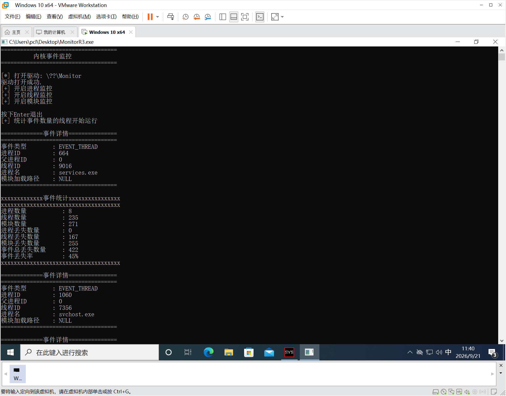
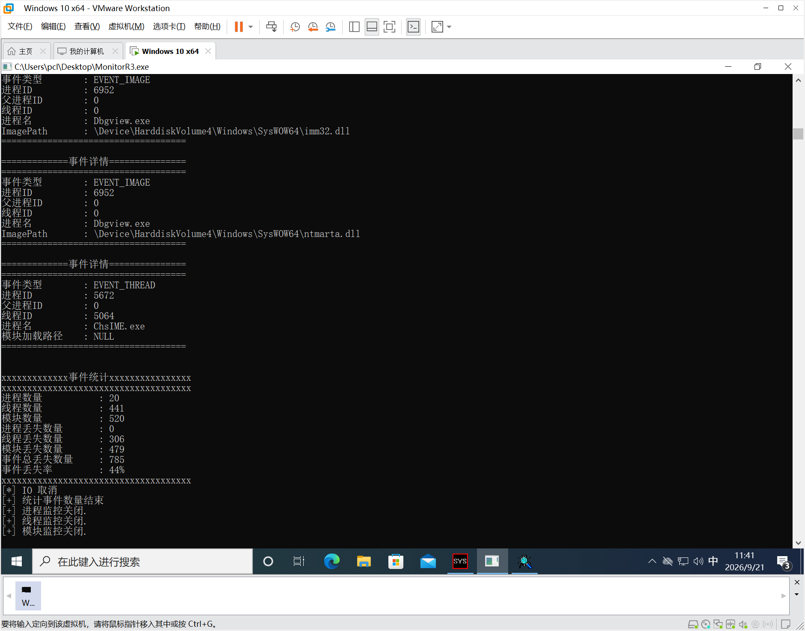

# Windows Kernel Monitor Driver

一个基于 **Windows Kernel Driver** 的轻量级系统事件监控项目，用于学习和实践 Windows Kernel、R3/R0 通信、Kernel Callback、IOCTL/IRP、Pending IRP、内核并发同步以及 Windows Driver Reverse Engineering。

> **Project Status:** Learning / Research Project
> **Target:** Windows x64
> **Language:** C
> **Environment:** Visual Studio 2022 + WDK + WinDbg + IDA

------

运行效果展示：




## 1. 项目简介

本项目实现了一个轻量级 Windows Kernel Monitor Driver，通过 Windows 提供的 Kernel Callback 机制监控以下系统事件：

- Process 创建 / 退出
- Thread 创建 / 退出
- EXE / DLL / Kernel Image 加载

内核驱动负责：

1. 注册 Kernel Callback
2. 捕获系统事件
3. 将事件统一封装
4. 写入 Kernel Event Queue
5. 当 Ring3 没有可读取事件时，通过 Pending IRP 等待
6. 新事件到达后完成等待中的 IRP
7. Ring3 程序获取并解析事件

项目同时对 Release 版本进行 IDA 静态逆向分析，用于研究：

- IOCTL Dispatch
- IRP 数据流
- Callback → Event Queue 数据流
- Ring Buffer
- C 结构体在汇编中的表现
- Pending IRP 生命周期
- x64 调用约定
- 内核函数调用关系

------

# 2. 项目整体架构

整体数据流：

```
                         User Mode
                             │
                             │ DeviceIoControl
                             ▼
                  ┌─────────────────────┐
                  │      MonitorR3      │
                  │   Event Thread      │
                  │   Statistics Thread │
                  └──────────┬──────────┘
                             │
                             │ IOCTL
                             ▼
════════════════════════ Kernel Boundary ════════════════════════
                             │
                             ▼
                  ┌─────────────────────┐
                  │    Monitor Driver   │
                  │                     │
                  │     IoDispatch      │
                  │     Event Manager   │
                  └──────────┬──────────┘
                             │
              ┌──────────────┼──────────────┐
              │              │              │
              ▼              ▼              ▼
       Process Callback Thread Callback Image Callback
              │              │              │
              └──────────────┼──────────────┘
                             ▼
                         PushEvent()
                             │
                             ▼
                  ┌─────────────────────┐
                  │    Event Queues     │
                  │                     │
                  │   Process Queue     │
                  │   Thread Queue      │
                  │   Image Queue       │
                  └──────────┬──────────┘
                             │
                             ▼
                       Pending IRP
                             │
                             ▼
                    IoCompleteRequest
                             │
                             ▼
                         Ring3 返回
```

核心链路可以概括为：

```
Kernel Callback
      ↓
  PushEvent()
      ↓
 Event Queue
      ↓
Pending IRP
      ↓
IoCompleteRequest()
      ↓
DeviceIoControl()
      ↓
 Ring3
```

------

# 3. 核心功能

## 3.1 Process Monitor

使用 Windows Process Notify Callback：

```
PsSetCreateProcessNotifyRoutine(...)
```

监控进程创建和退出。

记录：

- Process ID
- Parent Process ID
- Process Name
- Create / Exit 状态

基本流程：

```
Process Create / Exit
        ↓
Process Callback
        ↓
CreateProcessMonitor()
        ↓
MONITOR_EVENT
        ↓
PushEvent()
```

------

## 3.2 Thread Monitor

使用 Thread Notify Callback：

```
PsSetCreateThreadNotifyRoutine(...)
```

监控线程创建和退出。

主要记录线程相关事件，并统一转换为：

```
EVENT_THREAD
```

最终进入 Event Manager。

------

## 3.3 Image Monitor

使用 Image Load Notify Callback：

```
PsSetLoadImageNotifyRoutine(...)
```

监控：

- EXE 加载
- DLL 加载
- Kernel Image 加载

记录：

- Process ID
- Image Path
- Image Information

基本流程：

```
Image Load
    ↓
Image Callback
    ↓
CreateImageMonitor()
    ↓
MONITOR_EVENT
    ↓
PushEvent()
```

------

# 4. R3 / R0 通信

驱动创建 Device Object：

```
\Device\Monitor
```

并创建 Symbolic Link：

```
\??\Monitor
```

Ring3 使用：

```
CreateFileW(L"\\\\.\\Monitor",...);
```

打开设备。

之后通过：

```
DeviceIoControl(...)
```

向驱动发送 IOCTL 请求。

完整调用链：

```
CreateFileW()
      ↓
Device Object
      ↓
Device Handle
      ↓
DeviceIoControl()
      ↓
IRP_MJ_DEVICE_CONTROL
      ↓
IoDispatch()
      ↓
IOCTL Handler
```

这里重点研究的是：

```
User Mode API
      ↓
I/O Manager
      ↓
IRP
      ↓
IO_STACK_LOCATION
      ↓
Driver Dispatch Routine
```

------

# 5. IOCTL

当前项目使用：

```
METHOD_BUFFERED
```

进行 R3/R0 数据交换。

主要控制命令：

```
START_PROCESS
STOP_PROCESS

START_THREAD
STOP_THREAD

START_IMAGE
STOP_IMAGE

GET_EVENT_QUEUE
GET_STATISTICS
```

用户态调用：

```
DeviceIoControl()
```

之后，I/O Manager 创建并分发：

```
IRP_MJ_DEVICE_CONTROL
```

驱动在：

```
IoDispatch()
```

中根据：

```
IoControlCode
```

进行不同处理。

典型结构：

```
switch (IoControlCode)
{
    case IOCTL_START_PROCESS:
        ...
        break;

    case IOCTL_STOP_PROCESS:
        ...
        break;

    case IOCTL_GET_EVENT_QUEUE:
        ...
        break;

    case IOCTL_GET_STATISTICS:
        ...
        break;
}
```

------

# 6. Event Manager

项目没有尝试在 Kernel Callback 中直接完成复杂的 Ring3 通信，而是在内核中增加 Event Manager。

原因在于：

> Kernel Callback 的执行环境、IRQL、执行时间要求以及用户态通信机制与普通 Ring3 线程不同，因此更适合将 Callback 转换为内核事件，再由独立的通信路径向用户态传递。

整体结构：

```
Process Callback ──┐
                   │
Thread Callback ───┼──→ PushEvent()
                   │
Image Callback ────┘
                         │
                         ▼
                    Event Manager
                         │
              ┌──────────┼──────────┐
              ▼          ▼          ▼
        Process Queue Thread Queue Image Queue
```

这样可以把：

```
Callback
```

与：

```
R3/R0 Communication
```

解耦。

------

# 7. Unified Event Structure

不同类型的内核事件统一封装为：

```
typedef enum
{
    EVENT_PROCESS,
    EVENT_THREAD,
    EVENT_IMAGE
} EVENT_TYPE;
```

统一事件结构：

```
typedef struct
{
    EVENT_TYPE Type;

    ULONG ProcessId;
    ULONG ThreadId;
    ULONG ParentProcessId;

    CHAR ProcessName[64];

    WCHAR ImagePath[260];

} MONITOR_EVENT;
```

这样 Ring3 不需要维护三套完全独立的通信接口。

用户态收到事件之后，通过：

```
Event.Type
```

判断事件类型。

例如：

```
EVENT_PROCESS
EVENT_THREAD
EVENT_IMAGE
```

这也是项目中比较重要的一层抽象：

```
不同 Kernel Callback
        ↓
统一 Event
        ↓
统一 Event Queue
        ↓
统一 R3 通信接口
```

------

# 8. Ring Buffer

项目为不同类型的事件维护独立 Ring Buffer：

```
Process Queue
Thread Queue
Image Queue
```

队列核心状态：

```
buffer
readIndex
writeIndex
count
capacity
```

基本结构：

```
             writeIndex
                 ↓
        ┌───┬───┬───┬───┬───┬───┐
        │   │ E │ E │ E │   │   │
        └───┴───┴───┴───┴───┴───┘
          ↑
       readIndex
```

当索引到达：

```
capacity
```

时回绕：

```
index++;

if (index >= capacity)
{
    index = 0;
}
```

核心操作：

```
Producer
    ↓
writeIndex
    ↓
Queue

Consumer
    ↓
readIndex
    ↓
Queue
```

------

# 9. Kernel Synchronization

Process、Thread、Image Callback 都可能同时产生事件，因此 Event Queue 属于共享数据结构。

项目使用：

```
KSPIN_LOCK
```

保护队列状态。

典型流程：

```
Callback
   ↓
PushEvent()
   ↓
Acquire Spin Lock
   ↓
检查 Queue
   ↓
写入 Event / 获取等待 IRP
   ↓
更新 Queue State
   ↓
Release Spin Lock
```

这里主要研究：

- Kernel Concurrent Access
- Critical Section
- IRQL
- Spin Lock
- Producer / Consumer
- Race Condition
- Queue Overflow
- Synchronization

需要特别注意：

> Spin Lock 不只是“防止多个线程同时访问变量”，它同时涉及 IRQL 提升、临界区长度以及持锁期间能够执行哪些操作。

因此后续项目还会继续研究：

```
Spin Lock
    ↓
IRQL
    ↓
DISPATCH_LEVEL
    ↓
哪些 API 可以调用
    ↓
哪些操作不能在持锁期间执行
```

------

# 10. Pending IRP

当 Ring3 请求获取事件，而当前 Event Queue 为空时：

```
Ring3
  │
  │ DeviceIoControl(GET_EVENT_QUEUE)
  ▼
Driver
  │
  │ Queue Empty
  ▼
IoMarkIrpPending()
  │
  ▼
保存 IRP
  │
  ▼
IRP Pending
```

驱动不会立即完成该 IRP，而是保存等待中的请求。

当新的 Kernel Event 到达：

```
Process Callback
      ↓
PushEvent()
      ↓
检测 Waiting IRP
      ↓
写入 Event
      ↓
IoCompleteRequest()
      ↓
DeviceIoControl() 返回
      ↓
Ring3 获取 Event
```

因此用户态不需要采用：

```
while (...)
{
    DeviceIoControl(...);

    Sleep(...);
}
```

这种高频轮询方式。

而是：

```
Event Driven
```

模型：

```
没有事件
    ↓
等待

有事件
    ↓
完成 IRP
    ↓
Ring3 被唤醒
```

这部分是项目中比较重要的 I/O Manager 实践内容。

同时，Pending IRP 还涉及一个后续重点：

```
IRP Lifecycle
      ↓
Pending
      ↓
Completion
      ↓
Cancellation
      ↓
Unload
      ↓
Race Condition
```

------

# 11. Event Statistics

驱动维护事件统计信息：

```
typedef struct
{
    ULONG ProcessCount;
    ULONG ThreadCount;
    ULONG ImageCount;

    ULONG ProcessDropped;
    ULONG ThreadDropped;
    ULONG ImageDropped;

    ULONG DroppedEvents;

} MONITOR_STATISTICS;
```

统计：

```
Process Events
Thread Events
Image Events

Process Dropped
Thread Dropped
Image Dropped

Total Dropped
```

由于 Thread / Image 等事件可能产生较为频繁，当 Producer 速度超过 Consumer 处理速度时：

```
Producer Rate > Consumer Rate
```

Ring Buffer 最终可能发生：

```
Queue Full
    ↓
Event Dropped
```

因此项目同时用于研究：

- Event Statistics
- Producer / Consumer
- Queue Overflow
- Event Loss
- Atomic Operation

------

# 12. Ring3 Architecture

用户态程序采用多线程结构：

```
                    MonitorR3
                       │
             ┌─────────┴─────────┐
             │                   │
             ▼                   ▼
       Event Thread       Statistics Thread
             │                   │
             ▼                   ▼
     GET_EVENT_QUEUE      GET_STATISTICS
             │                   │
             ▼                   ▼
       Print Event         Print Statistics
```

## Event Thread

负责：

- 等待 Kernel Event
- 获取 Pending IRP 返回的数据
- 解析 Event
- 输出 Process / Thread / Image Event

## Statistics Thread

负责：

- 周期性获取统计信息
- 输出事件数量
- 输出丢失事件数量

两个线程分离后：

```
Event Thread
    ↓
Blocking I/O

Statistics Thread
    ↓
Periodic Query
```

互不阻塞。

------

# 13. 项目目录

```
MonitorDriver/
│
├── MonitorR0/
│   ├── DriverEntry.c
│   ├── IoDispatch.c
│   ├── Monitor.c
│   ├── ProcessMonitor.c
│   ├── ThreadMonitor.c
│   ├── ImageMonitor.c
│   ├── EventQueue.c
│   ├── EventQueue.h
│   ├── Monitor.h
│   └── MonitorIoctl.h
│
├── MonitorR3/
│   ├── include/
│   │   ├── MonitorIoctl.h
│   │   └── Monitor.h
│   │
│   └── src/
│       ├── Main.c
│       ├── EventThread.c
│       ├── StatisticThread.c
│       └── Print.c
│
└── README.md
```

------

# 14. 开发环境

推荐：

```
Windows 10 / Windows 11 x64
Visual Studio 2022
Windows Driver Kit (WDK)
Windows SDK
WinDbg
IDA
```

建议在虚拟机中进行驱动开发与调试。

开发过程中使用 Kernel Debugging：

```
WinDbg
    ↓
Kernel Debugger
    ↓
Monitor Driver
```

驱动测试环境应根据目标 Windows 版本配置对应 WDK、SDK 以及驱动签名/测试签名环境。

------

# 15. Kernel Debugging

项目开发过程中主要使用 WinDbg 进行 Kernel Debugging。

重点观察：

```
IRP
IO_STACK_LOCATION
DEVICE_OBJECT
DRIVER_OBJECT

EPROCESS
ETHREAD

IRQL
KSPIN_LOCK

Callback
Pending IRP
IoCompleteRequest
```

典型调试路径：

```
DriverEntry
    ↓
IoDispatch
    ↓
IOCTL
    ↓
Callback
    ↓
PushEvent
    ↓
Event Queue
    ↓
Dequeue
    ↓
IoCompleteRequest
```

重点研究对象：

```
IRP
    ↓
IO_STACK_LOCATION
    ↓
MajorFunction
    ↓
IoControlCode
    ↓
User Buffer
```

以及：

```
Callback
    ↓
Kernel Event
    ↓
Queue
    ↓
Pending IRP
    ↓
Completion
```

------

# 16. Windows Driver Reverse Engineering

本项目不仅用于驱动开发，同时作为自己的 Windows Driver Reverse Engineering 实验对象。

项目完成后，对 Release 版本进行静态分析。

主要使用：

```
IDA
```

------

## 16.1 IOCTL Dispatch Reverse

从：

```
IRP_MJ_DEVICE_CONTROL
```

开始定位 Dispatch Routine：

```
IRP_MJ_DEVICE_CONTROL
        ↓
IoDispatch()
        ↓
IOCTL switch
        ↓
具体 Handler
```

重点识别：

```
IoControlCode
IRP
IO_STACK_LOCATION
SystemBuffer
IoStatus.Status
IoStatus.Information
```

最终建立：

```
DeviceIoControl()
        ↓
IRP
        ↓
Dispatch
        ↓
IOCTL
        ↓
Kernel Function
```

之间的对应关系。

------

## 16.2 Event Queue Reverse

重点恢复 Ring Buffer 数据结构：

```
EVENT_QUEUE
    │
    ├── buffer
    ├── capacity
    ├── readIndex
    ├── writeIndex
    └── count
```

通过汇编识别：

```
imul index, sizeof(EVENT)
```

以及：

```
movups
mov
lea
```

等指令所体现的：

```
结构体访问
数组寻址
结构体复制
字段偏移
```

进一步建立：

```
C Structure
        ↕
Assembly
```

之间的对应关系。

------

# 16.3 Pending IRP Reverse

重点分析：

```
IoMarkIrpPending
IoCompleteRequest
IoSetCancelRoutine
Cancel Routine
```

研究：

```
IRP Pending
      ↓
IRP 保存
      ↓
Event Arrival
      ↓
IRP Completion
```

以及：

```
Cancel
   ↓
Cancel Routine
   ↓
IRP 状态变化
```

之间的关系。

核心目标不是单纯认识 API，而是理解：

> 一个 IRP 从用户态发起，到进入驱动、Pending、保存、完成或者取消的完整生命周期。

------

# 16.4 Callback Reverse

分析：

```
Process Callback
Thread Callback
Image Callback
```

到：

```
PushEvent()
```

之间的数据流。

重点观察：

```
Callback Arguments
        ↓
Local Variables
        ↓
MONITOR_EVENT
        ↓
PushEvent()
        ↓
Event Queue
```

并结合 x64 调用约定分析：

```
RCX
RDX
R8
R9
RSP
```

与 C 函数参数之间的对应关系。

------

# 17. 项目中的核心技术点

这个项目实际涉及的技术链条：

```
                 Windows Internals
                       │
          ┌────────────┼────────────┐
          │            │            │
          ▼            ▼            ▼
      Process       Thread       Image
      Callback      Callback     Callback
          │            │            │
          └────────────┼────────────┘
                       ▼
                   Event Model
                       │
                       ▼
                   Ring Buffer
                       │
                 ┌─────┴─────┐
                 │           │
             Spin Lock   IRP Pending
                 │           │
                 └─────┬─────┘
                       ▼
                    IOCTL
                       │
                       ▼
                 I/O Manager
                       │
                       ▼
                    Ring3
```

因此这个项目不是单纯的：

```
“写一个进程监控程序”
```

而是一次完整的：

```
Kernel Callback
        +
Kernel Synchronization
        +
I/O Manager
        +
IRP
        +
R3/R0 Communication
        +
Reverse Engineering
```

综合实践。

------

# 18. 当前限制

本项目明确定位为：

> Windows Kernel / Driver / Security Research Learning Project

并非生产级安全产品。

当前存在以下限制：

- Event Queue 容量有限
- 高并发事件下可能发生 Event Drop
- 当前 Pending IRP 管理主要面向单一 Ring3 Client
- 多客户端访问尚未进行完整隔离
- 错误处理仍需要进一步完善
- Callback 生命周期管理仍需要继续验证
- IRP Cancel / Completion Race 仍需要进一步研究
- Driver Unload 场景仍需要进行更完整的生命周期验证
- 没有实现完整的 EDR 行为分析
- 没有实现策略引擎
- 没有尝试绕过 PatchGuard、Code Integrity 等 Windows 安全机制

因此本项目主要用于：

```
Windows Driver Learning
        +
Windows Internals
        +
Kernel Security
        +
Reverse Engineering
```

------

# 19. 后续研究方向

计划进一步研究：

### I/O 与并发

- IRP Cancellation
- Cancellation Race
- 多 Pending IRP
- 多客户端
- Per-FileObject Context
- 更完善的 Event Manager
- Producer / Consumer 优化

### Windows Kernel

- EPROCESS / ETHREAD
- Object Manager
- Handle Table
- APC
- DPC
- IRQL
- Memory Manager
- Kernel Synchronization

### Windows Security

- MiniFilter
- ETW
- WFP
- NDIS
- Kernel Memory Analysis
- Crash Dump Analysis
- Driver Verifier
- EDR Architecture

### Reverse Engineering

- Windows Driver Static Analysis
- x64 Calling Convention
- C/C++ Object Layout
- Callback Registration
- IOCTL Reverse
- IRP Reverse
- Kernel Data Structure Recovery
- IDA + WinDbg 联合分析

------

# 20. 学习目标

通过这个项目，希望建立以下能力：

```
C
 ↓
Win32
 ↓
Windows I/O
 ↓
IRP / IOCTL
 ↓
Kernel Driver
 ↓
Callback
 ↓
Synchronization
 ↓
Windows Internals
 ↓
WinDbg
 ↓
IDA
 ↓
Driver Reverse Engineering
```

最终能够把：

```
源码
 ↓
编译器
 ↓
机器码
 ↓
汇编
 ↓
Windows Kernel
 ↓
硬件 / CPU
```

串联起来理解。

------

# 21. 适用范围

本项目仅用于：

- Windows Kernel 学习
- Windows Internals 学习
- Driver Development 学习
- Reverse Engineering 学习
- Security Research

请仅在合法、授权的测试环境中使用。

------

# 22. 项目说明

这是一个 Windows Kernel 初学阶段的个人研究项目。

项目的重点并不是实现一个完整的安全产品，而是通过：

```
自己设计
    ↓
自己实现
    ↓
WinDbg 调试
    ↓
IDA 逆向
    ↓
重新理解汇编与 Kernel
```

建立从 **Windows API → I/O Manager → IRP → Kernel → Callback → 内核数据结构 → 汇编** 的完整技术链路。

欢迎指出实现、设计和理解上的问题。